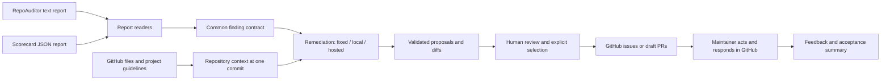

# Standalone architecture

| Boundary | Responsibility | Does not do |
| --- | --- | --- |
| `readers/` | Validate explicitly selected report formats; retain evidence | Run checks or import upstream packages |
| `models.py` | Shared finding, context, proposal and versioned-run contracts | Network, file publication or model calls |
| `context.py`, `github.py` | Bounded GitHub reads at an immutable commit | Execute repository code or instructions |
| `catalog.py` | Map known findings to reviewed responses | Infer fixes for unsupported findings |
| `providers.py` | Consult chosen model and validate its response | Execute tools, choose a license or publish |
| `preview.py`, `batch.py` | Orchestrate previews and isolated repository outcomes | Mutate target repositories |
| `publish.py`, `storage.py` | Explicit selection, stale checks, deduplication, receipts | Force push, enable settings or merge |
| `feedback.py` | Read maintainer decisions and report denominators | Treat issue closure as acceptance |
| `cli.py`, `config.py` | Typer commands, user workflow and minimal local configuration | Hide failed/unsupported outcomes |

Report adapters keep their upstream formats outside the remediation modules. Add
an adapter by normalizing to `Report`; add a fixed response via the catalog's
`Finding, Context → Proposal | Outcome` contract. Add a provider behind the same
proposal boundary, retaining path/content/action validation and explicit mode selection.
No module inside RepoAuditor or Scorecard needs changing.

The security prototype informed the three action patterns and beta inputs. Its
shell scripts were not copied wholesale: authentication, branching, error handling,
preview and feedback now have separate modules. Automatic MIT licensing and conflating
Dependabot version schedules with security-update settings were intentionally excluded.

## Trust and persistence

Reports, repository documentation and model responses are untrusted data. The tool
never executes repo-supplied commands. It reads only relevant root/.github/docs
instruction files for the initial document-change scope; non-regular and oversized
files are flagged. Model-generated originals/SHAs are not trusted: the tool supplies
those from the fetched snapshot. Existing-file edits require that same content and
SHA at publication; any default-branch movement requires a fresh review.

`run.json` is versioned review state, not a signed attestation. Review edits to it
as carefully as proposed diffs; publication revalidates its contracts and current
GitHub state. Output directories use private permissions where supported. Keep
private-repository run artifacts private. Run files preserve report evidence and may
contain project content. `.env` and generated runs are ignored by Git.

Remote duplicate checks and a local run lock protect normal retries. Separate
publishers can still race to create an issue because GitHub has no atomic issue
idempotency key. Coordinate publication across auditors; this is a documented limit,
not a distributed queue or enterprise multi-tenant service.
